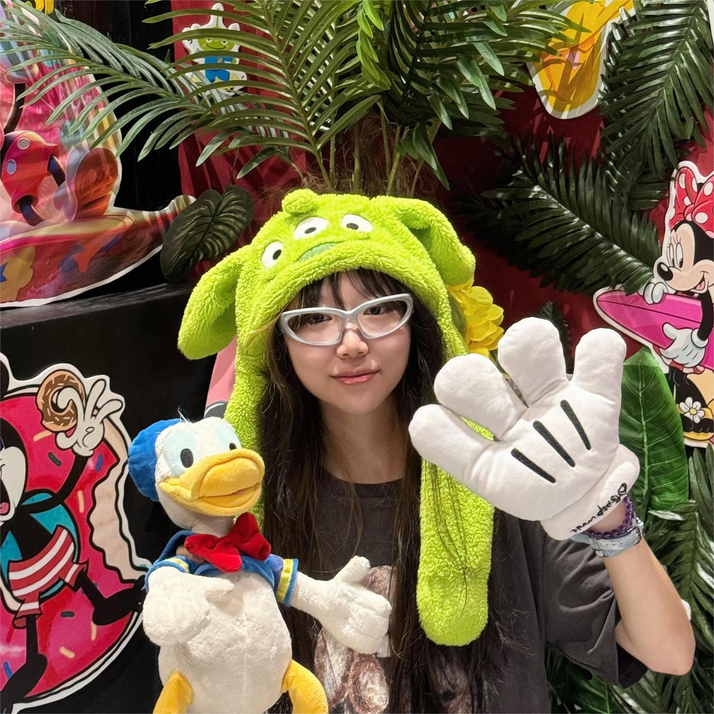

## About Me

 

Hi there, welcome to my website!

I am a fourth-year undergraduate student at [South China University of Technology](https://www.scut.edu.cn/en/), where I am fortunate to be advised by Prof. [Jianhua Tang](https://scholar.google.com/citations?user=kvlKtAEAAAAJ&hl=en).  

My research goal is to empower AI with capabilities beyond the human level to _assist humans effectively_ in diverse areas such as decision-making and complex problem-solving. I am particularly interested in two interconnected questions:  
- (i) How can AI research draw inspiration from human learning processes?
- (ii) How can these insights be advanced to provide greater benefits in real-world scenarios?

To achieve my goal, my current research interests lie in **natural language processing** and **machine learning**, and I am particularly interested in AI (self-)evolution/improvement. I am currently working as a research intern under the guidance of Prof. [Jiaxin Huang](https://teapot123.github.io/) at Washington University in St. Louis. 

Email: <a href="mailto:jiayihe3612@gmail.com">jiayihe3612@gmail.com</a>, <a href="mailto:202164020171@mail.scut.edu.cn">202164020171@mail.scut.edu.cn</a>  
[Github](https://github.com/ivy3h)/[Twitter](https://x.com/ivy3h)

## Experiences

- Research Intern, Washington University in St. Louis (07/2024 - now)  
  Advisor: [Jiaxin Huang](https://teapot123.github.io/)

- Research Intern, University of Illinois, Urbana-Champaign (04/2024 - now)  
  Advisor: [Yiren Fung](https://yrf1.github.io/)

- Research Intern, South China University of Technology (11/2022 - now)    
  Advisor: [Jianhua Tang](http://www2.scut.edu.cn/wusie/2020/0425/c25374a374016/page.htm)

